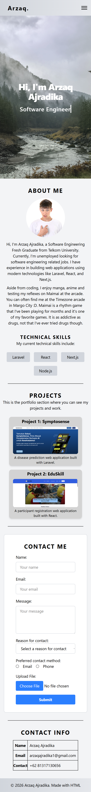

# Personal Portfolio Website - Milestone 1

## Overview
This is the first milestone project for my RevoU FullStack Software Engineer Bootcamp. It is a personal website designed to showcase my progress and portfolio.

**Website includes:**
- **Home Section:** Visual introduction and welcome message.
- **About Me:** Biography about myself and interests.
- **Technical Skills:** A semantic list of tech skills.
- **Portfolio Section:** Showcasing Symptosense and EduSkill with descriptions and images.
- **Contact Form:** A functional HTML form with validation and accessible labels.
- **Contact Information Table:** A table of my contact info.

## Features Implemented
- **Semantic HTML:** Used tags like `<header>`, `<nav>`, `<main>`, `<section>`, `<article>`, and `<figure>`.
- **Data Integrity:** Organized contact information in structured <table> formats and valid HTML5 forms.
- **Typing Animation:** Custom CSS @keyframes with steps() timing to simulate a real-time typing experience for my job title.
- **Interactive Hover Effects:** Added transform: scale(1.05) and box-shadow transitions to Project and Skill cards.
- **Modern Branding:** Used Tailwind v4 gradients and refined typography to create a professional "Software Engineer" aesthetic.
- **The "Checkbox Hack" Navbar:** A 100% CSS-driven mobile hamburger menu using peer selectors—no JavaScript required.
- **Adaptive Grid System:** * Projects Switches from a 2-column Desktop grid to a 1-column Mobile stack.
- **Flex-Wrap Skills:** Technical skill badges automatically wrap to new rows on smaller screens to prevent horizontal overflow.

## Technologies Used
- HTML5: Semantic structure.
- Tailwind CSS v4: Utility-first styling and responsive breakpoints.
- Custom CSS: Keyframe animations and advanced pseudo-selectors.
- Git/GitHub: Version control and deployment via GitHub Pages.

## Screenshots & Demos
### Desktop View

### Mobile View

## Access the website
You can view the deployed website here: [Link](https://revou-fsse-feb26.github.io/milestone-1-Sayiki/)